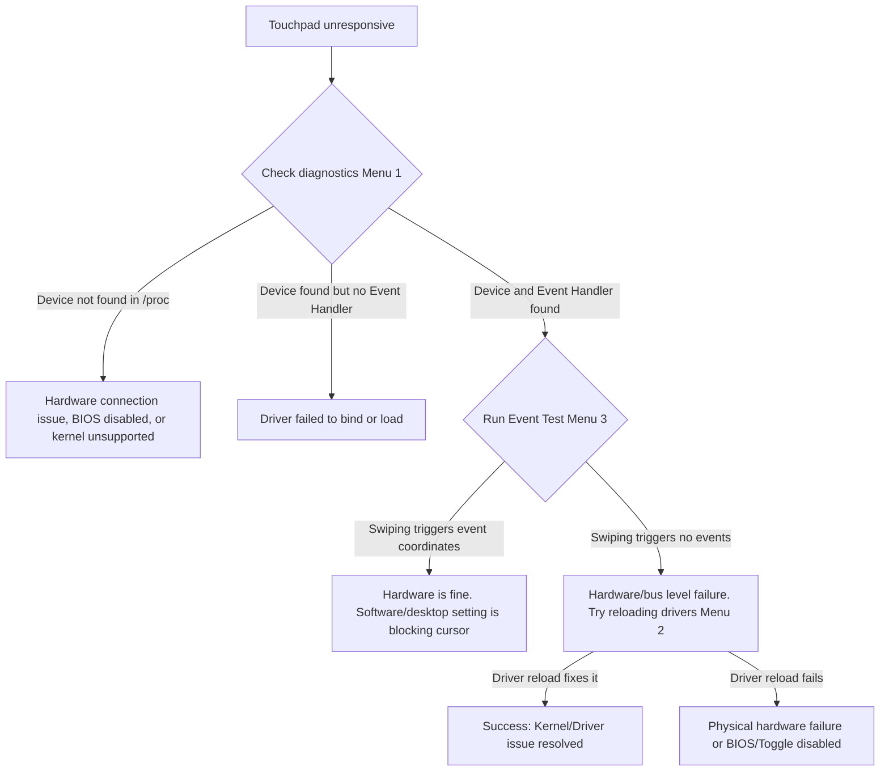

# Dell Touchpad Troubleshooter & Data Collector

An interactive Python utility to troubleshoot Dell/Alps trackpads on Linux when they stop responding. This tool is designed to address a common trackpad issue affecting Dell Latitude models on Linux distributions.

### 💻 Tested Environment
```text
    .:cccccccccccccccccccccccccc:.        OS: Fedora Linux 44 (KDE Plasma Desktop Edition) x86_64
  .;ccccccccccccc;.:dddl:.;ccccccc;.      Host: Latitude 5480
                                          Kernel: Linux 7.0.11-200.fc44.x86_64
```

---

## 📋 Prerequisites & Dependencies

The utility is written in pure Python and requires no external Python libraries, but relies on some standard Linux tools for diagnostics:
* **libinput-utils** (Fedora) or **libinput-tools** (Ubuntu/Debian) — Required to run physical event tests (Menu Option 3).
* **systemd / journalctl** — Used to fetch recent system logs.
* **busctl** — Required to query KWin DBus properties.

Install `libinput` tools on your distribution:
* **Fedora/RHEL:**
  ```bash
  sudo dnf install -y libinput-utils
  ```
* **Ubuntu/Debian:**
  ```bash
  sudo apt-get install -y libinput-tools
  ```

---

## 🚀 How to Run the Tool

Ensure the script is executable:
```bash
chmod +x touchpad_tool.py
```

### Interactive Mode
You can run the script interactively to use the built-in menu:
```bash
./touchpad_tool.py
```

### Non-Interactive CLI Arguments
You can also run specific actions directly from the command line:

*   **Automatic Fix** (unloads and reloads kernel modules directly, requires `sudo`):
    ```bash
    ./touchpad_tool.py --fix
    ```
*   **Status Check** (performs diagnostics and prints results to terminal):
    ```bash
    ./touchpad_tool.py --status
    ```
*   **Export Report** (runs diagnostics and exports to a file):
    ```bash
    ./touchpad_tool.py --report
    ```

---

## 🛠️ Main Features & Options

### 1. Run All Diagnostics (Health Check)
Performs a comprehensive scan of your touchpad's status:
*   **Hardware Detection**: Scans `/proc/bus/input/devices` to verify the trackpad device is visible to the kernel and find its active event handler (e.g., `/dev/input/event7`).
*   **Kernel Modules**: Checks if the necessary drivers (`hid_alps`, `i2c_hid_acpi`, `i2c_hid`, `psmouse`) are loaded in memory.
*   **KDE Config Check**: Reads your desktop user settings file (`~/.config/kcminputrc`) to see if the trackpad has been disabled in the desktop configuration.
*   **KWin DBus Status**: Direct query to KWin (Fedora Wayland Window Manager) to see if it has marked the device as active or disabled.
*   **Log Analysis**: Pulls recent boot logs from `journalctl` matching the touchpad and filters for kernel errors or jumping events.

### 2. Reload Touchpad Drivers (Fix Unresponsive Trackpad)
When your trackpad stops responding due to a driver crash or erratic jump:
*   Unloads the stacked kernel modules (`hid_alps`, `i2c_hid_acpi`, and `i2c_hid`).
*   Reloads them in sequence.
*   *Note: This operation requires root/sudo privileges to load and unload kernel modules.*

### 3. Test Physical Hardware Events (libinput listener)
To determine if the issue is a physical hardware fault or just a software misconfiguration:
*   Launches a 5-second listener via `libinput debug-events`.
*   **What to do**: Swipe your finger on the trackpad during the 5-second window.
*   If you see output coordinates, the hardware and kernel are working perfectly, meaning the issue is purely a Wayland/KWin desktop setting. If you see no output, the touchpad is not sending physical signals.

### 4. Export Diagnostic Log to File
*   Generates a clean text file named `touchpad_diagnostic_report.txt` in the folder where you ran the script.
*   You can open, read, or share this report.

---

### 🔍 Troubleshooting Decision Tree

To help you isolate if the issue is a physical hardware fault, driver problem, or desktop configuration:



#### Explaining the Flow
1. **No Device listed:** Check BIOS settings to make sure the Touchpad/Pointing Device is enabled. If it is enabled but missing, it could be a hardware issue (e.g., loose ribbon cable).
2. **Device exists but no Events:** Try the physical hardware hotkeys first (Fn+F3, Fn+F5, Fn+F9). If it still does not send events, try reloading the drivers (Option 2).
3. **Events exist but no Cursor movement:** Go to your desktop settings (KDE Settings -> Input Devices -> Touchpad) and check if it is disabled, or use KWin/Wayland configuration commands.

---

## 🔋 Automating Reload on Suspend/Resume

On many Dell laptops, the touchpad driver crashes or fails to wake up correctly when resuming from sleep. You can automate reloading the driver on resume using a systemd service:

1. Copy the script to a global path:
   ```bash
   sudo cp touchpad_tool.py /usr/local/bin/touchpad_tool.py
   sudo chmod +x /usr/local/bin/touchpad_tool.py
   ```

2. Create a systemd service file:
   ```bash
   sudo nano /etc/systemd/system/touchpad-resume.service
   ```

3. Paste the following configuration:
   ```ini
   [Unit]
   Description=Reload Touchpad Drivers on Resume
   After=suspend.target hibernate.target hybrid-sleep.target suspend-then-hibernate.target

   [Service]
   Type=oneshot
   ExecStart=/usr/local/bin/touchpad_tool.py --fix

   [Install]
   WantedBy=suspend.target hibernate.target hybrid-sleep.target suspend-then-hibernate.target
   ```

4. Enable the service:
   ```bash
   sudo systemctl enable touchpad-resume.service
   ```

---

## 📝 Common Dell Hotkeys
If the tool diagnostics show that the touchpad is software-disabled or not receiving events, try pressing the hardware toggle key. On Dell laptops, this is usually:
*   **Fn + F3**
*   **Fn + F9**
*   **Fn + F5**
*   Or press the function key directly (depending on your BIOS toggle setup).
